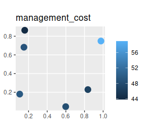
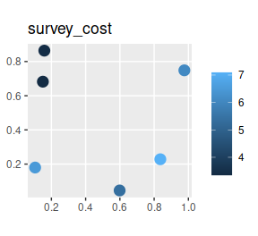
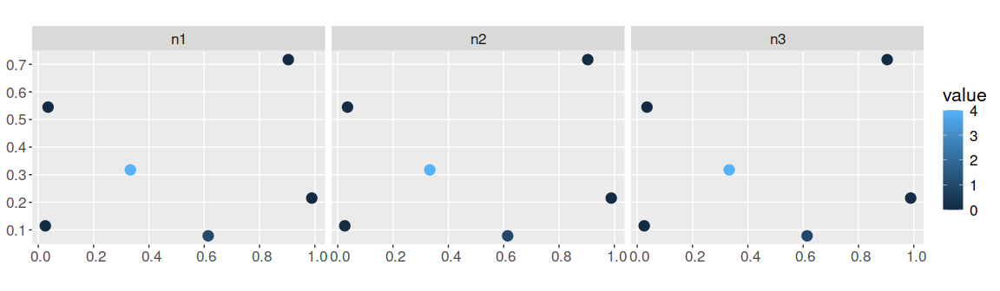
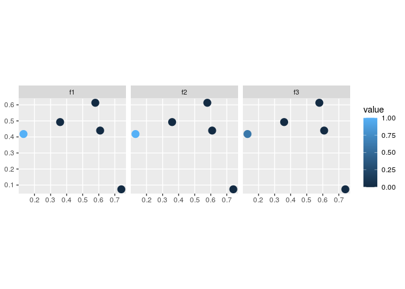
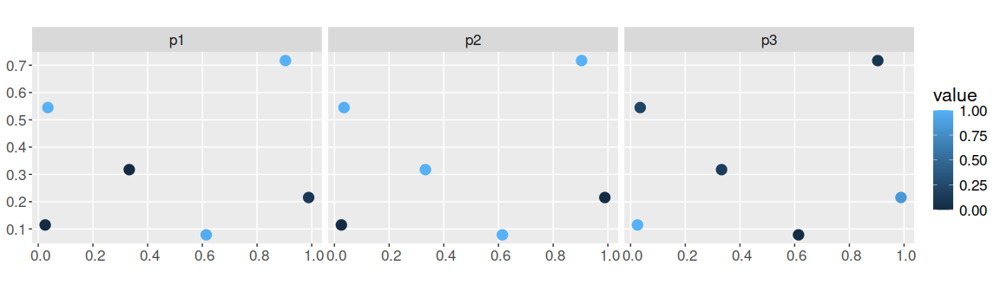
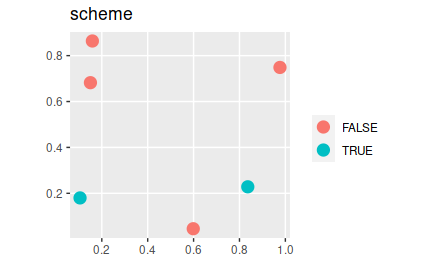

<!--- README.md is generated from README.Rmd. Please edit that file -->

# surveyvoi: Survey Value of Information

[](https://lifecycle.r-lib.org/articles/stages.html)
[](https://github.com/jeffreyhanson/surveyvoi/actions)
[](https://github.com/jeffreyhanson/surveyvoi/actions)
[](https://github.com/jeffreyhanson/surveyvoi/actions)
[](https://codecov.io/github/jeffreyhanson/surveyvoi?branch=master)
[](https://CRAN.R-project.org/package=surveyvoi)

The *surveyvoi* package is a decision support tool for prioritizing
sites for ecological surveys based on their potential to improve plans
for conserving biodiversity (e.g. plans for establishing protected
areas). Given a set of sites that could potentially be acquired for
conservation management – wherein some sites have previously been
surveyed and other sites have not – this package provides functionality
to generate and evaluate plans for additional surveys. Specifically,
plans for ecological surveys can be generated using various conventional
approaches (e.g. maximizing expected species richness, geographic
coverage, diversity of sampled environmental conditions) and by
maximizing value of information. After generating plans for surveys,
they can also be evaluated using value of information analysis. Please
note that several functions depend on the ‘Gurobi’ optimization software
(available from <https://www.gurobi.com>). Additionally, the JAGS
software (available from <https://mcmc-jags.sourceforge.io/>) is
required to fit hierarchical generalized linear models.

## Installation

The latest official version of the *surveyvoi R* package can be
installed from the [Comprehensive R Archive Network
(CRAN)](https://cran.r-project.org/) using the following *R* code.

``` r
install.packages("surveyvoi", repos = "https://cran.rstudio.com/")
```

Alternatively, the latest development version can be installed from
[GitHub](https://github.com/jeffreyhanson/surveyvoi) using the following
code. Please note that while developmental versions may contain
additional features not present in the official version, they may also
contain coding errors.

``` r
if (!require(remotes)) install.packages("remotes")
remotes::install_github("jeffreyhanson/surveyvoi")
```

#### Windows

The [Rtools](https://cran.r-project.org/bin/windows/Rtools/) software
needs to be installed to install the *surveyvoi R* package from source.
This software provides system requirements from
[rwinlib](https://github.com/rwinlib/).

#### Ubuntu

The `gmp`, `mpfr`, and `symphony` libraries need to be installed to
install the *surveyvoi R* package. For recent versions of Ubuntu (18.04
and later), these libraries are available through official repositories.
They can be installed using the following system commands:

    apt-get -y update
    apt-get install -y libgmp3-dev libmpfr-dev coinor-libsymphony-dev

#### Linux

For Unix-alikes, `gmp` (&gt;= 4.2.3), `mpfr` (&gt;= 3.0.0), and
`symphony` (&gt;= 5.6.16) are required.

#### MacOS

The `gmp`, `mpfr`, and `symphony` libraries need to be installed to
install the *surveyvoi R* package. The easiest way to install these
libraries is using [HomeBrew](https://brew.sh/). After installing
HomeBrew, these libraries can be installed using the following commands
in the system terminal:

    brew tap coin-or-tools/coinor
    brew install symphony
    brew install pkg-config
    brew install gmp
    brew install mpfr

## Citation

Please cite the *surveyvoi R* package when using it in publications. To
cite the latest official version, please use:

> Hanson JO, Chadès I, Hudgins EJ, Bennett J (2021). surveyvoi: Survey
> Value of Information. R package version 1.0.1. Available at
> <https://CRAN.R-project.org/package=surveyvoi>.

## Usage

Here we provide a short example showing how to use the *surveyvoi R*
package to prioritize funds for ecological surveys. In this example, we
will generate plans for conducting ecological surveys (termed “survey
schemes”) using simulated data for six sites and three conservation
features (e.g. bird species). To start off, we will set the seed for the
random number generator for reproducibility and load some R packages.

``` r
set.seed(500)      # set RNG for reproducibility
library(surveyvoi) # package for value of information analysis
library(dplyr)     # package for preparing data
library(tidyr)     # package for preparing data
library(ggplot2)   # package for plotting data
```

Now we will load some datasets that are distributed with the package.
First, we will load the `sim_sites` object. This spatially explicit
dataset (i.e. `sf` object) contains information on the sites within our
study area. Critically, it contains (i) sites that have already been
surveyed, (ii) candidate sites for additional surveys, (iii) sites that
have already been protected, and (iv) candidate sites that could be
protected in the future. Each row corresponds to a different site, and
each column describes different properties associated with each site. In
this table, the `"management_cost"` column indicates the cost of
protecting each site; `"survey_cost"` column indicates the cost of
conducting an ecological survey within each site; and `"e1"` and `"e2"`
columns contain environmental data for each site (not used in this
example). The remaining columns describe the existing survey data and
the spatial distribution of the features across the sites. The `"n1"`,
`"n2"`, and `"n3"` columns indicate the number of surveys conducted
within each site that looked for each of the three features
(respectively); and `"f1"`, `"f2"`, and `"f3"` columns describe the
proportion of surveys within each site that looked for each feature
where the feature was detected (respectively). For example, if `"n1"`
has a value of 2 and `"f1"` has a value of 0.5 for a given site, then
the feature `"f1"` was detected in only one of the two surveys conducted
in this site that looked for the feature. Finally, the `"p1"`, `"p2"`,
and `"p3"` columns contain modelled probability estimates of each
species being present in each site (see `fit_hglm_occupancy_models()`
and `fit_xgb_occupancy_models()` to generate such estimates for your own
data).

``` r
# load data
data(sim_sites)

# print table
print(sim_sites, width = Inf)
```

    ## Simple feature collection with 6 features and 13 fields
    ## Geometry type: POINT
    ## Dimension:     XY
    ## Bounding box:  xmin: 0.10513 ymin: 0.04556193 xmax: 0.9764926 ymax: 0.8637977
    ## CRS:           NA
    ## # A tibble: 6 x 14
    ##   survey_cost management_cost    f1    f2    f3    n1    n2    n3     e1     e2
    ##         <dbl>           <dbl> <dbl> <dbl> <dbl> <dbl> <dbl> <dbl>  <dbl>  <dbl>
    ## 1        3.43            43.8     1 1     0         5     5     5 -1.38   0.425
    ## 2        6.07            59.0     0 0     0         0     0     0  0.736 -1.01 
    ## 3        7.09            46.7     0 0     0         0     0     0  0.754 -0.959
    ## 4        6.50            49.6     0 0     0         0     0     0  0.530  1.51 
    ## 5        5.37            48.1     0 0     0         0     0     0  0.546 -0.525
    ## 6        3.35            48.9     1 0.667 0.333     3     3     3 -1.18   0.557
    ##      p1    p2    p3               geometry
    ##   <dbl> <dbl> <dbl>                <POINT>
    ## 1 0.941 0.999 0.057  (0.1589075 0.8637977)
    ## 2 0.36  0.006 0.259  (0.9764926 0.7485368)
    ## 3 0.337 0.006 0.305  (0.8362375 0.2282762)
    ## 4 0.048 0.579 0.998     (0.10513 0.179855)
    ## 5 0.335 0.032 0.488 (0.5985786 0.04556193)
    ## 6 0.896 0.998 0.145  (0.1504241 0.6821156)

``` r
# plot cost of protecting each site
ggplot(sim_sites) +
geom_sf(aes(color = management_cost), size = 4) +
ggtitle("management_cost") +
theme(legend.title = element_blank())
```



``` r
# plot cost of conducting an additional survey in each site
# note that these costs are much lower than the protection costs
ggplot(sim_sites) +
geom_sf(aes(color = survey_cost), size = 4) +
ggtitle("survey_cost") +
theme(legend.title = element_blank())
```



``` r
# plot survey data
## n1, n2, n3: number of surveys in each site that looked for each feature
sim_sites %>%
select(n1, n2, n3) %>%
gather(name, value, -geometry) %>%
ggplot() +
geom_sf(aes(color = value), size = 4) +
facet_wrap(~name, nrow = 1)
```



``` r
# plot survey results
## f1, f2, f3: proportion of surveys in each site that looked for each feature
##             that detected the feature
sim_sites %>%
select(f1, f2, f3) %>%
gather(name, value, -geometry) %>%
ggplot() +
geom_sf(aes(color = value), size = 4) +
facet_wrap(~name, nrow = 1) +
scale_color_continuous(limits = c(0, 1))
```



``` r
# plot modelled probability of occupancy data
sim_sites %>%
select(p1, p2, p3) %>%
gather(name, value, -geometry) %>%
ggplot() +
geom_sf(aes(color = value), size = 4) +
facet_wrap(~name, nrow = 1) +
scale_color_continuous(limits = c(0, 1))
```



Next, we will load the `sim_features` object. This table contains
information on the conservation features (e.g. species). Specifically,
each row corresponds to a different feature, and each column contains
information associated with the features. In this table, the `"name"`
column contains the name of each feature; `"survey"` column indicates
whether future surveys would look for this species;
`"survey_sensitivity"` and `"survey_specificity"` columns denote the
sensitivity (true positive rate) and specificity (true negative rate)
for the survey methodology for correctly detecting the feature;
`"model_sensitivity"` and `"model_specificity"` columns denote the
sensitivity (true positive rate) and specificity (true negative rate)
for the species distribution models fitted for each feature; and
`"target"` column denotes the required number of protected sites for
each feature (termed “representation target”, each feature has a target
of 1 site).

``` r
# load data
data(sim_features)

# print table
print(sim_features, width = Inf)
```

    ## # A tibble: 3 x 7
    ##   name  survey survey_sensitivity survey_specificity model_sensitivity
    ##   <chr> <lgl>               <dbl>              <dbl>             <dbl>
    ## 1 f1    TRUE                0.954              0.886             0.718
    ## 2 f2    TRUE                0.974              0.875             0.705
    ## 3 f3    TRUE                0.956              0.823             0.768
    ##   model_specificity target
    ##               <dbl>  <dbl>
    ## 1             0.811      1
    ## 2             0.860      1
    ## 3             0.887      1

After loading the data, we will now generate an optimized ecological
survey scheme. To achieve this, we will use
`approx_optimal_survey_scheme()` function. This function uses a greedy
heuristic algorithm to maximize value of information. Although other
functions can return solutions that are guaranteed to be optimal
(i.e. `optimal_survey_scheme()`), they can take a very long time to
complete because they use a brute-force approach. This function also
uses an approximation routine to reduce computational burden.

To perform the optimization, we will set a total budget for (i)
protecting sites and (ii) surveying sites. Although you might be
hesitant to specify a budget, please recall that you would make very
different plans depending on available funds. For instance, if you have
near infinite funds then you wouldn’t bother conducting any surveys and
simply protect everything. Similarly, if you had very limited funds,
then you wouldn’t survey any sites to ensure that at least one site
could be protected. Generally, conservation planning problems occur
somewhere between these two extremes—but the optimization process can’t
take that into account if you don’t specify a budget. For brevity, here
we will set the total budget as 80% of the total costs for protecting
sites.

``` r
# calculate budget
budget <- sum(0.8 * sim_sites$management_cost)

# generate optimized survey scheme
opt_scheme <-
  approx_optimal_survey_scheme(
    site_data = sim_sites,
    feature_data = sim_features,
    site_detection_columns = c("f1", "f2", "f3"),
    site_n_surveys_columns = c("n1", "n2", "n3"),
    site_probability_columns = c("p1", "p2", "p3"),
    site_management_cost_column = "management_cost",
    site_survey_cost_column = "survey_cost",
    feature_survey_column = "survey",
    feature_survey_sensitivity_column = "survey_sensitivity",
    feature_survey_specificity_column = "survey_specificity",
    feature_model_sensitivity_column = "model_sensitivity",
    feature_model_specificity_column = "model_specificity",
    feature_target_column = "target",
    total_budget = budget,
    survey_budget = budget,
    verbose = TRUE)
```

``` r
# the opt_scheme object is a matrix that contains the survey schemes
# each column corresponds to a different site,
# and each row corresponds to a different solution
# in the event that there are multiple near-optimal survey schemes, then this
# matrix will have multiple rows
print(str(opt_scheme))
```

    ##  logi [1, 1:6] FALSE FALSE TRUE TRUE FALSE FALSE
    ##  - attr(*, "ev")= num [1, 1:100] 2.92 2.92 2.92 2.92 2.92 ...
    ## NULL

``` r
# let's add the first solution (row) in opt_scheme to the site data to plot it
sim_sites$scheme <- c(opt_scheme[1, ])

# plot scheme
# TRUE = selected for an additional ecological survey
# FALSE = not selected
ggplot(sim_sites) +
geom_sf(aes(color = scheme), size = 4) +
ggtitle("scheme") +
theme(legend.title = element_blank())
```



This has just been a taster of the *surveyvoi R* package. In addition to
this functionality, it can be used to evaluate survey schemes using
value of information analysis. Furthermore, it can be used to generate
survey schemes using conventional approaches (e.g. sampling
environmental gradients, and selecting places with highly uncertain
information). For more information, see the [package
vignette](http://jeffrey-hanson.com/surveyvoi/articles/surveyvoi.html).

## Getting help

If you have any questions about using the *surveyvoi R* package or
suggestions for improving it, please [file an issue at the package’s
online code
repository](https://github.com/jeffreyhanson/surveyvoi/issues/new).
