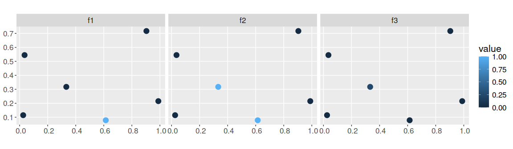

<!--- README.md is generated from README.Rmd. Please edit that file -->
Survey Value of Information
===========================

[](https://www.tidyverse.org/lifecycle/#experimental) [](https://travis-ci.org/jeffreyhanson/surveyvoi) [](https://ci.appveyor.com/project/jeffreyhanson/surveyvoi) [](https://codecov.io/github/jeffreyhanson/surveyvoi?branch=master) [](https://CRAN.R-project.org/package=surveyvoi)

The *surveyvoi* package is a decision support tool for prioritizing sites for ecological surveys based on their potential to improve plans for conserving biodiversity (e.g. plans for establishing protected areas). Given a set of sites that could potentially be acquired for conservation management -- wherein some sites have previously been surveyed and other sites have not -- this package provides functionality to generate and evaluate plans for additional surveys. It provides functionality to generate plans using various conventional approaches (e.g. expected species richness) and directly maximizing return on investment using optimization algorithms. Plans for conducting ecological surveys are evaluated using value of information analysis, which explicitly accounts for the cost of conducting additional surveys when evaluating their return on investment.

Installation
------------

The *surveyvoi R* package is still in an experimental phase of the development cycle and so it is not yet available on [Comprehensive R Archive Network (CRAN)](https://cran.r-project.org/). To install latest developmental version from [GitHub](https://github.com/jeffreyhanson/surveyvoi), please use the following R code. Note that developmental versions may contain coding errors.

``` r
if (!require(remotes)) install.packages("remotes")
remotes::install_github("jeffreyhanson/surveyvoi")
```

Citation
--------

Please cite the *surveyvoi R* package when using it in publications. To cite the latest development version, please use:

> Hanson JO, Bennett J (2020). surveyvoi: Survey Value of Information. R package version 0.0.63. Available at <https://github.com/jeffreyhanson/surveyvoi>.

Usage
-----

Here we will provide a short example showing how the *surveyvoi R* package can be used to prioritize funds for ecological surveys. In this example, we will generate plans for conducting ecological surveys (temred "survey schemes") using simulated data for `nrow(sim_sites)` sites and `nrow(sim_features)` conservation features (e.g. bird species). To start off, we will set the seed for the random number generator to ensure you get the same results as shown here, and load some R packages.

``` r
set.seed(500)
library(surveyvoi) # package for value of information analysis
library(dplyr)     # package for preparing data
library(tidyr)     # package for preparing data
library(ggplot2)   # package for plotting data
```

Now we will load some datasets that are distributed with the package. First, we will load the `sim_sites` object. This spatially explicit dataset (i.e. `sf`) contains information on the sites within our study area. Critically, it contains (i) sites that have already been surveyed, (ii) candidate sites for additional surveys, (iii) sites that have already been protected, and (iv) candidate sites that could be protected in the future. Each row corresponds to a different site, and each column describes different properties associated with each site. In this table, the `"management_cost"` column indicates the cost of protecting each site; `"survey_cost"` column the cost of conducting an ecological survey within each site; and `"e1"` and `"e2"` columns contain environmental data for each site (not used in this example). The remaining columns describe the existing survey data and the spatial distribution of the features across the sites. The `"n1"`, `"n2"`, and `"n3"` columns indicate the number of surveys conducted within each site that looked for each of the `nrow(sim_features)` features (respectively); and `"f1"`, `"f2"`, and `"f3"` columns describe the proportion of surveys within each site that looked for each feature where the feature was detected (respectively). For example, if `"n1"` has a value of 2 and `"f1"` has a value of 0.5 for a given site, then the feature `"f1"` was detected in only one of the two surveys conducted in this site that looked for the feature. Finally, the `"p1"`, `"p2"`, and `"p3"` columns contain modelled probability estimates of each species being present in each site (see `fit_hglm_occupancy_models` or `fit_xgb_occupancy_models` to generate such estimates for your own data).

``` r
# load data
data(sim_sites)

# print table
print(sim_sites, width = Inf)
```

    ## Simple feature collection with 5 features and 13 fields
    ## geometry type:  POINT
    ## dimension:      XY
    ## bbox:           xmin: 0.1313267 ymin: 0.07352338 xmax: 0.7405901 ymax: 0.6129639
    ## CRS:            NA
    ## # A tibble: 5 x 14
    ##   survey_cost management_cost    f1    f2    f3    n1    n2    n3     e1     e2
    ##         <dbl>           <dbl> <dbl> <dbl> <dbl> <dbl> <dbl> <dbl>  <dbl>  <dbl>
    ## 1        6.21            58.4     1     1   0.6     5     5     5 -1.38   1.42 
    ## 2        8.01            57.1     0     0   0       0     0     0  0.454 -0.532
    ## 3        7.62            58.1     0     0   0       0     0     0  1.28  -0.409
    ## 4        6.48            60.5     0     0   0       0     0     0 -0.489  0.604
    ## 5        7.12            54.7     0     0   0       0     0     0  0.133 -1.08 
    ##      p1    p2    p3               geometry
    ##   <dbl> <dbl> <dbl>                <POINT>
    ## 1 0.835 1     0.605  (0.1313267 0.4181095)
    ## 2 0.387 0.048 0.414  (0.6087037 0.4398096)
    ## 3 0.073 0.002 0.927  (0.5785847 0.6129639)
    ## 4 0.613 0.964 0.617  (0.3594235 0.4926529)
    ## 5 0.716 0.073 0.043 (0.7405901 0.07352338)

``` r
# plot management cost data
ggplot(sim_sites) +
geom_sf(aes(color = management_cost), size = 4) +
ggtitle("management_cost") +
theme(legend.title = element_blank())

# plot management cost data
ggplot(sim_sites) +
geom_sf(aes(color = survey_cost), size = 4) +
ggtitle("survey_cost") +
theme(legend.title = element_blank())
```


``` r
# plot survey data
## n1, n2, n3: number of surveys in each site that looked for each feature
sim_sites %>%
select(n1, n2, n3) %>%
gather(name, value, -geometry) %>%
ggplot() +
geom_sf(aes(color = value), size = 4) +
facet_wrap(~name, nrow = 1)
```


``` r
## f1, f2, f3: proportion of surveys in each site that looked for each feature
##             that detected the feature
sim_sites %>%
select(f1, f2, f3) %>%
gather(name, value, -geometry) %>%
ggplot() +
geom_sf(aes(color = value), size = 4) +
facet_wrap(~name, nrow = 1) +
scale_color_continuous(limits = c(0, 1))
```



``` r
# plot modelled probability of occupancy data
sim_sites %>%
select(p1, p2, p3) %>%
gather(name, value, -geometry) %>%
ggplot() +
geom_sf(aes(color = value), size = 4) +
facet_wrap(~name, nrow = 1) +
scale_color_continuous(limits = c(0, 1))
```


Next, we will load the `sim_features` object. This table contains information on the conservation features (e.g. species). Specifically, each row corresponds to a different feature, and each column contains information associated with the features. In this table, the `"name"` column contains the name of each feature; `"survey"` column indicates whether future surveys would look for this species; `"survey_sensitivity"` and `"survey_specificity"` columns denote the sensitivity (true positive rate) and specificity (true negative rate) for the survey methodology for correctly detecting the feature; `"model_sensitivity"` and `"model_specificity"` columns denote the sensitivity (true positive rate) and specificity (true negative rate) for the species distribution models fitted for each feature; and `"target"` column denotes the required number of protected sites for each feature to be present within (termed "representation target", each feature has a target of `sim_sites$target[1]` sites).

``` r
# load data
data(sim_features)

# print table
print(sim_features, width = Inf)
```

    ## # A tibble: 3 x 7
    ##   name  survey survey_sensitivity survey_specificity model_sensitivity
    ##   <chr> <lgl>               <dbl>              <dbl>             <dbl>
    ## 1 f1    TRUE                0.964              0.844             0.707
    ## 2 f2    TRUE                0.980              0.861             0.751
    ## 3 f3    TRUE                0.967              0.849             0.793
    ##   model_specificity target
    ##               <dbl>  <dbl>
    ## 1             0.811      1
    ## 2             0.896      1
    ## 3             0.805      1

After loading the data, we will now generate an optimized ecological survey scheme. To achieve this, we will use `approx_optimal_survey_scheme` function. This function uses a greedy heuristic algorithm to maximize return on investment. Although other functions can return solutions that are guarantee to be optimal (i.e. `optimal_survey_scheme`), they can take a very long time to complete (because they use a brute-force approach to optimize return on investment).

To perform this optimization, we will set a total budget for (i) protecting sites and (ii) surveying sites. Although you might be hesitant to specify a budget, please recall that you would make very different conservation plans depending on available funds. For instance, if you have infinite funds then you wouldn't bother conducting any surveys and simply protect everything. Similarly, if you had very limited funds, then you would need to use all of those funds for protecting sites since conducting surveys would only diminish reduce available funds. It is somewhere between these two extremes that conducting additional surveys actually improves a conservation plan. For brevity, here we will set the total budget as 80% of the total costs for protecting sites.

``` r
# calculate budget
budget <- sum(0.8 * sim_sites$management_cost)

# generate optimized survey scheme
opt_scheme <-
  approx_optimal_survey_scheme(
    site_data = sim_sites,
    feature_data = sim_features,
    site_detection_columns = c("f1", "f2", "f3"),
    site_n_surveys_columns = c("n1", "n2", "n3"),
    site_probability_columns = c("p1", "p2", "p3"),
    site_management_cost_column = "management_cost",
    site_survey_cost_column = "survey_cost",
    feature_survey_column = "survey",
    feature_survey_sensitivity_column = "survey_sensitivity",
    feature_survey_specificity_column = "survey_specificity",
    feature_model_sensitivity_column = "model_sensitivity",
    feature_model_specificity_column = "model_specificity",
    feature_target_column = "target",
    total_budget = budget,
    survey_budget = budget,
    verbose = TRUE)
```

    ## 
      |                                                                            
      |                                                                      |   0%
      |                                                                            
      |=====                                                                 |   7%
      |                                                                            
      |=========                                                             |  13%
      |                                                                            
      |==============                                                        |  20%
      |                                                                            
      |===================                                                   |  27%
      |                                                                            
      |=======================                                               |  33%
      |                                                                            
      |============================                                          |  40%
      |                                                                            
      |=================================                                     |  47%
      |                                                                            
      |=====================================                                 |  53%
      |                                                                            
      |==========================================                            |  60%
      |                                                                            
      |===============================================                       |  67%
      |                                                                            
      |===================================================                   |  73%
      |                                                                            
      |========================================================              |  80%
      |                                                                            
      |=============================================================         |  87%
      |                                                                            
      |=================================================================     |  93%
      |                                                                            
      |======================================================================| 100%

``` r
# the opt_scheme object is a matrix which can contain multiple survey schemes
# in the event that there are multiple optimal survey scheme,
print(str(opt_scheme))
```

    ##  logi [1, 1:5] FALSE TRUE FALSE FALSE TRUE
    ##  - attr(*, "ev")= num [1, 1:100] 2.88 2.88 2.88 2.88 2.88 ...
    ## NULL

``` r
# let's add the first solution (row) in opt_scheme to the site data to plot it
sim_sites$scheme <- c(opt_scheme[1, ])

# plot scheme
ggplot(sim_sites) +
geom_sf(aes(color = scheme), size = 4)
```


``` r
ggtitle("scheme") +
theme(legend.title = element_blank())
```

    ## NULL

This has just been a taster of the *surveyvoi R* package. For more information, see the [package vignette](https://jeffreyhanson.github.io/surveyvoi/articles/surveyvoi.html).

Getting help
------------

If you have any questions about using the *surveyvoi R* package or suggestions for improving it, please [file an issue at the package's online code repository](https://github.com/jeffreyhanson/surveyvoi/issues/new).
